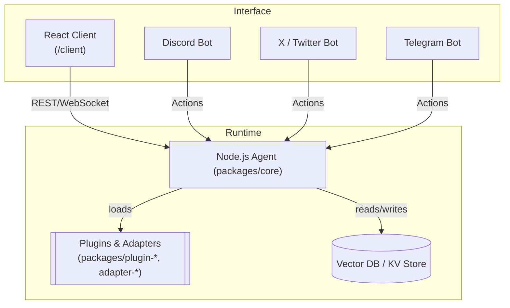

# GigabaldAI – Project Overview

> Version generated on <!-- UPDATE:DATE -->

---

## 1. What is GigabaldAI?

GigabaldAI (a fork of the **Eliza OS** project) is a Web-3 friendly **AI Agent Operating System**.  
It provides everything needed to build, run and scale LLM-powered, multi-modal agents that can live on Discord, X (Twitter), Telegram, or your own website.

Key characteristics:

-   **Monorepo** powered by **pnpm workspace** & **Turborepo** – all packages live in the same repository.
-   **TypeScript-first** – every runtime package is authored in TypeScript & bundled with **tsup**.
-   **Plugin architecture** – adapters, clients and plugins can be added/removed at runtime.
-   **Dual runtime** – a long-running Node.js **agent** and a React/Vite **client** front-end.

---

## 2. Repository Layout

```text
/gigabaldai
│
├── agent/                 # Thin convenience wrapper for starting the core agent
├── client/                # Vite + React SPA chat UI
├── packages/              # Publishable npm packages (core, plugins, adapters…)
│   ├── core/              # The heart of the system (agents, actions, memory)
│   ├── adapter-sqlite/    # Vector‐store adapter backed by SQLite & PGVector
│   ├── plugin-*           # First-party plugins (twitter, web-search, multiversx …)
│   └── …
├── docs/                  # Docusaurus site for public documentation
├── scripts/               # Utility CLIs & CI helpers (start.sh, bug_hunt, jsdoc-automation …)
├── tests/                 # Cross-package integration / regression tests
└── *                      # Root configs (tsconfig, turbo.json, pnpm-workspace.yaml …)
```

---

## 3. High-Level Architecture



-   **Agent runtime**: event loop that receives messages, selects & executes **Actions**, maintains memory, and produces responses via chosen LLM provider.
-   **Plugins / Adapters**: extend the runtime with new `Action`s, vector stores, model providers or external integrations.
-   **Client**: single-page application for chatting, debugging and visualising agent internals.

---

## 4. Key Packages

| Package             | Purpose                                                                         |
| ------------------- | ------------------------------------------------------------------------------- |
| `@elizaos/core`     | Agent core: character schema, action execution engine, memory, model selection. |
| `adapter-sqlite`    | Embedding & retrieval via SQLite/pg-vector.                                     |
| `plugin-twitter`    | Bi-directional Twitter (X) client.                                              |
| `plugin-web-search` | Action that performs web searches & returns scraped content.                    |
| `plugin-bootstrap`  | Utility actions shared by most starter characters.                              |
| `client-direct`     | Lightweight REST wrapper for talking to a remote agent.                         |

_All packages are individually versioned and publishable to npm._

---

## 5. Build & Development Flow

1. `pnpm install` – installs workspace dependencies using pnpm workspaces.
2. `pnpm build` – uses **turbo** to parallel-build every `package.json` that defines a `build` script (powered by **tsup** or **tsc**).
3. `pnpm start` – boots the agent via `packages/core/dist/index.js` (or the helper under `/agent`).
4. `pnpm start:client` – runs Vite dev-server under `/client`.

### Turbo pipeline

See `turbo.json` – common tasks are _build_, _dev_, _test_ with caching across CI.

---

## 6. Data Flow (Request-Response)

1. **Message Ingress** – a message arrives from Discord/Twitter or the Web client.
2. **Context Assembly** – `core/src/context.ts` gathers recent memory, tool outputs and embeddings.
3. **Action Planning** – `core/src/agents/planner.ts` chooses which `Action` to execute (zero-shot or multi-shot LLM call).
4. **Action Execution** – selected `Action` (could be `web-search`, `sql-query`, etc.) performs side-effects.
5. **LLM Response** – agent crafts final answer and emits it to all subscribed clients.
6. **Memory Update** – new conversation chunk is embedded & persisted (SQLite or other vector store).

---

## 7. Testing & Quality

-   Unit tests: `vitest` inside individual packages (see `packages/*/__tests__`).
-   End-to-end: `tests/` with plain node scripts and snapshot assertions.
-   Linting/Formatting: [Biome](https://biomejs.dev/) rules in `biome.json` (replaces eslint + prettier).
-   Conventional commits enforced via `commitlint`
-   Coverage: `pnpm test:coverage` collects V8 coverage and uploads to Codecov.

---

## 8. Deployment Options

| Target       | How                                                           |
| ------------ | ------------------------------------------------------------- |
| Docker       | `docker-compose.yaml` spins up the agent + optional PGVector. |
| Fleek (IPFS) | One-click deploy via `scripts/start.sh` guides you.           |
| Gitpod       | `.gitpod.yml` boots a dev container with GPU hints.           |
| PM2          | `pnpm pm2:start` script inside `core` for production daemon.  |

---

## 9. Extending the System

1. **New Action** – `pnpm new:action my-action` (schematic) → implement under `packages/plugin-*/src/actions/`.
2. **New Client** – implement a class that conforms to `packages/core/src/clients/BaseClient.ts`.
3. **Swap LLM** – Provide OpenAI, Groq, Mistral, etc. API keys in `.env` and set `model` in character file.
4. **Custom Character** – JSON schema defined in `docs/api/variables/CharacterSchema.md`.

---

## 10. Important CLI Commands

```bash
pnpm clean             # Remove dist, node_modules and build cache
pnpm dev               # Dev-watch core & plugins
pnpm test              # Run all unit tests via turbo
pnpm run docs:preview  # Build & preview Docusaurus site
npx elizaos plugins list
```

---

## 11. Further Reading

-   `/docs` – full dev-guide & API reference.
-   [Technical Report (arXiv)](https://arxiv.org/pdf/2501.06781)
-   Community Discord: https://discord.gg/elizaos

---

> _This overview is auto-generated. Feel free to extend or open an issue if something is missing._
